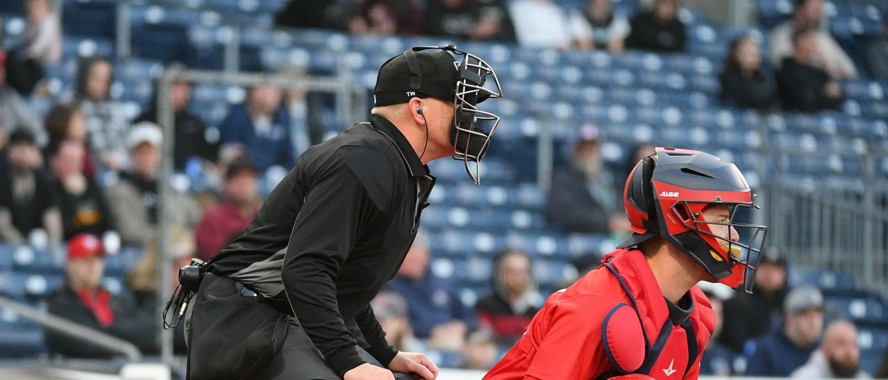
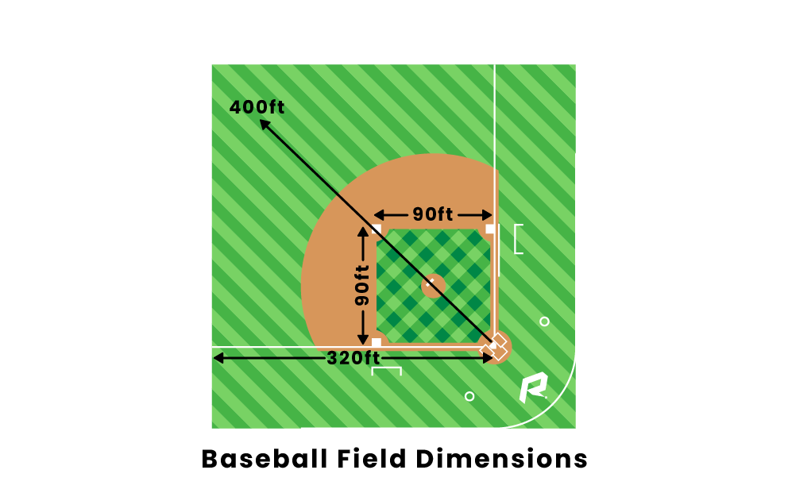
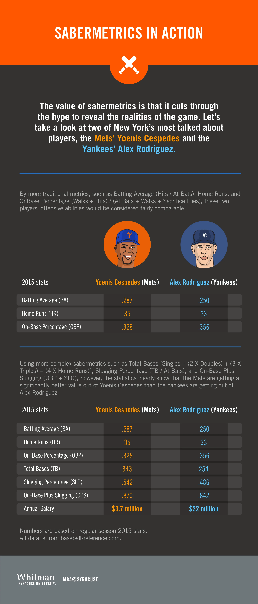
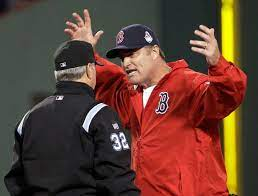

# AI in Major League Baseball
*A case study in how Artificial Intelligence is impacting Major League Baseball*
---
**Table of Contents**
- [Major League Overview](#header1)
    - [MLB: History](#subheader1)
    - [Baseball Rules](#subheader2)
    - [Major League Baseball Structure](#subheader3)
- [AI in Baseball](#header2)
    - [Sabermetrics](#subheader4)
    - [Data Driven Valuations](#subheader5)
    - [Automated Ball-Strike System (ABS)](#subheader6)
- [Conclusion and Recommendations](#header3)
- [Sources](#header4)
---

Artificial intelligence is a relatively new domain that can hold different meanings to different people.  However, in a general sense, it is the practice of developing computer systems to perform tasks that would normally require human intelligence.

AI is being used in a variety of domains, from healthcare to business and everywhere in between.  One of its more unique applications has been within the realm of sports.  This case study is intended to provide a brief overview of what Major League Baseball is, and how AI is being used within Major League Baseball to enhance the overall product.

## Major League Baseball Overview

### History
Baseball's origins date back to mid-18th century England when it was then brought to North America.  It was recognized as the national sport of the United States by the late 19th century around the same time that Major League Baseball was created in 1869 with the creation of the first professional baseball team: the Cicinnati Red Stockings (now known simply as the Reds).

Since that time, Major League Baseball has grown to its present state of 30 total teams divided across two divisions, the American League and the National League

### Baseball Rules
Baseball has a relatively simple premise.  There is diamond structure set up with four bases, each base being 90 feet away from the other, creating a perimiter of 360 feet.  To score runs, a batter tries to hit a ball in such a way that they can can successfully advanced around each base back to where they started (called home base).  

The person throwing the ball (called the pitcher) attempts to get the ball past the batter without them hitting the ball while keeping the ball in the strike zone, or causing the batter to swing and miss a pitch.  If the pitcher can do this successfully three times, the batter is out.  Teams have three outs per inning in 9 total innings to score runs.  At the end of those 9 innings, the team with the most runs wins the game.

### Major League Baseball Structure

Major League Baseball has grown to be a large organization, with over 12,000 employees according to [zoominfo.com](https://www.zoominfo.com/c/major-league-baseball/15111096).  In 2022, it reported [revenues](https://www.google.com/url?sa=t&rct=j&q=&esrc=s&source=web&cd=&cad=rja&uact=8&ved=2ahUKEwjHloPpq6GEAxXLiO4BHXlxB3YQFnoECBQQAw&url=https%3A%2F%2Fwww.statista.com%2Fstatistics%2F193466%2Ftotal-league-revenue-of-the-mlb-since-2005%2F%23%3A~%3Atext%3DIn%25202022%252C%2520Major%2520League%2520Baseball%2Cmillion%2520U.S.%2520dollars%2520per%2520team.&usg=AOvVaw1XVD5P2A3UrCopmAIVrpsf&opi=89978449) of 10.32 billion dollars. It provides entertainment for millions of fans in multiple countries, and ranks above both the NBA and NHL for average TV [ratings](https://www.forbes.com/sites/maurybrown/2023/08/17/groundbreaking-report-on-mlb-shows-baseballs-incredible-value-for-advertisers/?sh=34a638e76346).  For the 30 teams in Major League Baseball, the goal is to be in a position after the 162 game regular season to reach the Playoffs, and from there to ultimately win the World Series (the championship in MLB).  

There is no salary cap in the MLB, meaning that owners have carte blanche to go after the players that they think will give them the best opportunity to win the championship.  In general, this has meant that larger-market teams who have more money to spend will traditionally outpace the smaller-market clubs because they will be more willing to drop higher amounts of money to entice the "best" players.
  

This disparity in spending has led to smaller-market teams finding creative ways to generate the most value for the amount of money they're willing to spend.  Enter analytics and AI.

## AI in Baseball

### Sabermetrics
For much of baseball's history, managers and team scounts would be looking for athletes who had great aptitude in what are considered the five tools of baseball: hitting power, hitting for average, fielding ability, throwing ability, and speed.  Players who excelled at all five of these tools were the most sought-after, as they were extremely rare, and would therefore command millions of dollars in salary to be enticed to play for a team.

Bill James created a whole new method of evaluating players that ignored the human element and focused instead on empirical data that helped identify key metrics that would allow teams to win games.  This methodology, called "[sabermetrics](https://onlinegrad.syracuse.edu/blog/sabermetrics-baseball-analytics-the-science-of-winning-accessible/)", was implemented in the early 2000's by Billy Beane, the manager of the Oakland Athletics (also knows as the Oakland A's).  

Popularized in the 2011 movie *Moneyball*, the A's were one of the smallest market teams in the MLB, and spent the least amount of money year over year.  However, the implementation of sabermetrics led the A's to finding lesser-valued players who excelled at specific metrics, allowing the A's to achieve remarkable regular-season and postseason success.  

### Data Driven Valuations
While finding diamonds in the rough helped smaller-market teams to compete with larger-markets teams, games are still won and lost by those players on the field.  Machine learning and advanced motion tracking systems are being implemented by teams across all of Major League Baseball to help identify best training practices, assess player strengths and weakness, and reduce injury likelihood.

From Inclusion's blog on "How AI is Reshaping Major League Baseball":
> AI-powered models can analyze pitching mechanics to detect minute adjustments that may enhance a pitcher’s performance and reduce the likelihood of injuries. This data-driven approach has empowered MLB teams to make informed decisions when recruiting talent and crafting game strategies, providing a competitive edge on the field. 

Additionally, regarding advanced motion tracking system usage in the MLB: 
> Advanced motion tracking systems can monitor a pitcher’s release point, spin rate, and pitch trajectory. Batters can have their swing analyzed with precise metrics, such as launch angle and exit velocity, aiding in refining their hitting approach. This technology not only improves player development but also contributes to injury prevention by monitoring workload and fatigue. 

These are some examples of how AI is being used to help MLB teams fill out their personnel and to aid players in achieving their maximum potential.  However, there is an additional usage of AI that is being considered in Major League Baseball which could change an important aspect of the game itself.

### Automated Ball-Strike System (ABS)
One important role in baseball is the home plate umpire.  It's this person's job to judge whether a ball thrown by the pitcher is within the strike zone (called a strike) or outside of the strike zone (called a ball).  As a side note, the strike zone is an imaginary rectangular zone that runs from the batter's knees to his midsection.

While these umpires are traditionally very accurate, they are human and do make mistakes, particularly on pitches that are very close to being either a strike or a ball.  This will lead to batters and managers being frustrated, causing confrontations with the umpirte and players/managers occasionally being ejected.  It has become a unique part of the game that contributes to its entertaining nature.

In an effort to reduce the inaccuracy introduced by human empires, Major League Baseball has been experimenting with a system known as ABS.  From an article in Baseball America:
> The automated ball-strike system (ABS), known colloquially as robo-umps, uses the Hawk-Eye tracking system to determine whether a pitch is a ball or strike and relays the call to the home plate umpire via an earpiece.

The Hawk-Eye tracking system mentioned in the quote has been implemented in several sports around the globe, but most notably in tennis.  It allows players to challenge rulings on whether a ball was in or out of the field of play.  Using a system of a cameras, as well as some advanced modeling/tracking techniques, it demonstrates the exact location where the ball struck tennis court, providing an indisputable method of identifying exactly where a ball landed on a tennis court 

This same technology is being applied to baseball, but to track where a ball crossed the strike zone.  There are two methods of implementation that are currently being tested in Minor League Baseball: the full ABS method, or the challenge system.

The full ABS method would essentially remove human umpire judgements entirely from baseball.  All balls and strikes would be determined by the ABS system.

The challenge system would retain the human umpires, but teams would have three challenges they could to question an umpire's ruling on a ball or a strike.  The umpires would then refer to the ABS system as the "final" judgment.

Both methods have pros and cons associated with them.  While the full ABS method would promise the most accurate form of baseball in terms of called strikes or balls, it would also remove a couple of important elements to the current game: 1) with officials (which provides additional entertainment for fans), and 2) the need for "catcher framing" (the skill by catchers to essentially frame the way they catch the ball to try to steal or preserve a strike). 

The challenge system, meanwhile, is basically a way of minimizing human error, but it doesn't eliminate it entirely.  This means that if an umpire is wildly inaccurate for a game, it would still be possible for some important calls to be missed, and for a team to not have enough challenges to overrule the umpire's judgment.

## Conclusion and Recommendations
Major League Baseball has been one of the pioneers in sports when it comes to adopting AI practices.  Whether it was sabermetrics helping small-market teams narrow the gap, or using regression and advanced motion-tracking methods to enhance player performance, AI has been used liberally to help improve various aspects of the game.

But the Automated Ball-Strike System takes things to a whole new level with its potential significance.  Full ABS implementation would change the very nature of the game as we know it.

My own recommendation would be for Major League Baseball to adopt the challenge system.  This allows baseball to retain several important aspects of the game in catcher framing as well as the ability of the players and managers to judge the location of the pitch on their own in order to determine whether to issue a challenge or not.

But most of all, it retains the human judgment and interactions aspect of the game for both players and fans alike. 

 

It's human nature for us to disagree when something doesn't go in our favor.  It helps to lessen the blow of a loss  when we gather around water coolers at work to discuss the horrible call(s) which we feel led to our team's failure.  In a paradoxical way, the subjective nature of officiating is something that can bring fans closer together because of the artificial divide it creates between fans and officials.

Ultimately, it will be up to Major Leage Baseball to determine what it feels is in its own best interest, and the interest of its fans, and the next direction it wants to take with the power of AI.

## Sources
1. [Inclusion: *The Smart Playbook: How AI is Reshaping Major League Baseball*](https://inclusioncloud.com/insights/blog/ai-major-league-baseball-mlb/)
1. [Baseball America: *The Automated Strike Zone is Slightly Different At Triple-A in 2023*](https://www.baseballamerica.com/stories/the-automated-strike-zone-is-slightly-different-at-triple-a-in-2023/#:~:text=The%20automated%20ball%2Dstrike%20system%20(ABS)%2C%20known%20colloquially,all%2030%20stadiums%20this%20year.)
1. [PR Newswire: *Hawk-Eye Innovations and MLB Introduce Next-Gen Baseball Tracking and Analytics Platform*](https://www.prnewswire.com/news-releases/hawk-eye-innovations-and-mlb-introduce-next-gen-baseball-tracking-and-analytics-platform-301115828.html)
1. [AP: *Robo umps reach Triple-A, but MLB rollout still uncertain*](https://apnews.com/article/robo-umps-abs-triplea-ccc901dc69c6101fb6a793e5fe867a77)
1. [Hitterish: *What is a 5 tool player?*](https://www.hitterish.com/single-post/what-is-5-tool-player)

